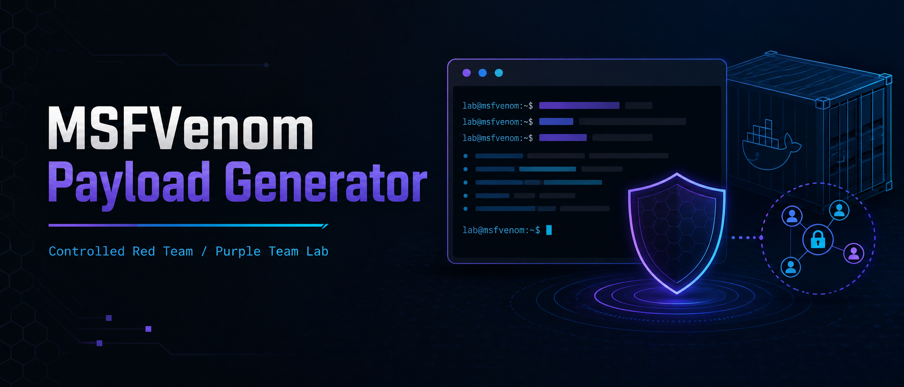
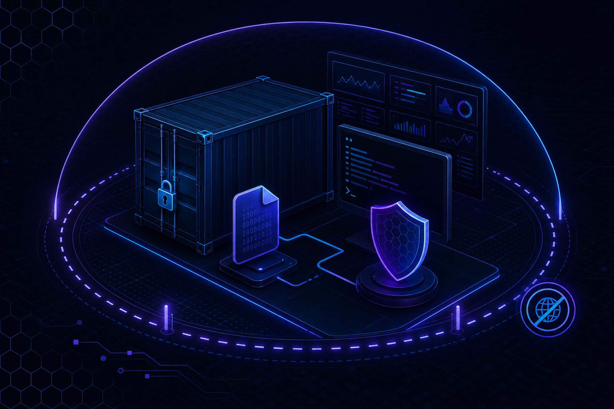
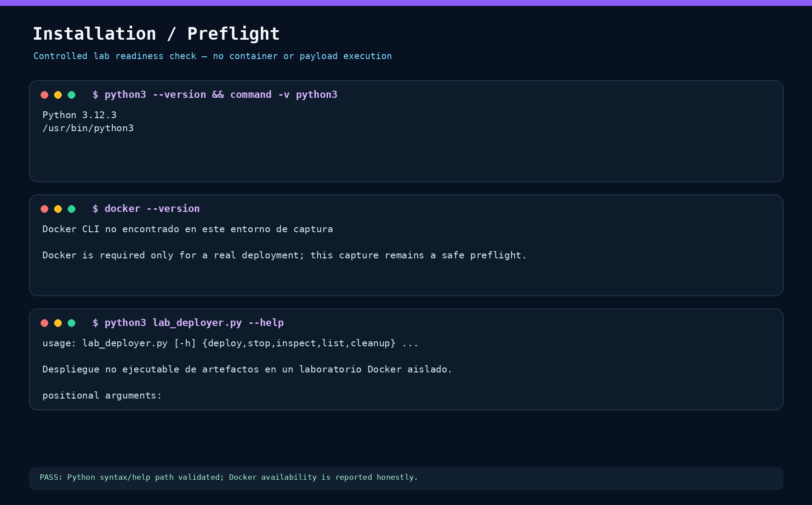
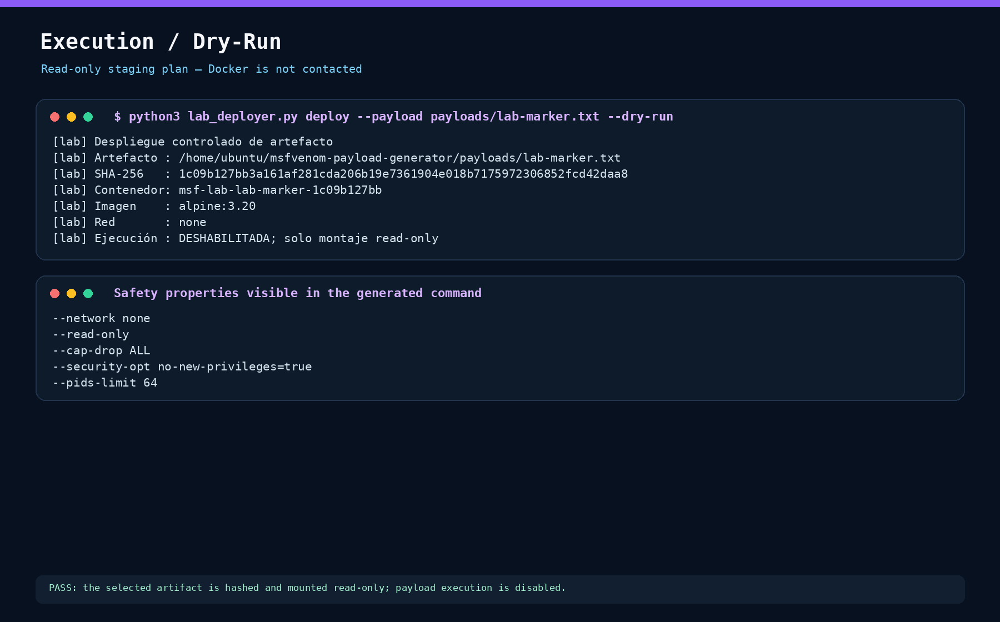

# MSFVenom Payload Generator v4.0

Herramienta de línea de comandos para **laboratorios de Red Team, ejercicios Purple Team y pruebas de penetración autorizadas**. El proyecto proporciona una interfaz interactiva alrededor de `msfvenom` para generar artefactos de prueba, crear archivos de recursos para `msfconsole`, levantar opcionalmente un handler y observar nuevas sesiones a través del log local de Metasploit.



> **Aviso de uso autorizado:** este repositorio no debe utilizarse contra sistemas, redes, cuentas o dispositivos para los que no exista autorización explícita, vigente y documentada. El operador es responsable de definir el alcance, las reglas de enfrentamiento, las ventanas de prueba, los objetivos permitidos, la gestión de evidencias y la limpieza posterior.

## Alcance

`MSFVenomPayloadGeneratorv4.0.py` centraliza varias tareas repetitivas de un flujo de validación ofensiva: consulta de payloads y formatos disponibles, construcción de comandos `msfvenom`, generación de archivos `.rc` para `exploit/multi/handler`, lanzamiento opcional de `msfconsole`, monitorización de sesiones y entrega controlada de archivos mediante varios mecanismos de transferencia.

La herramienta **no implementa un exploit**, no contiene payloads generados y no sustituye la validación manual del alcance. Su función es orquestar utilidades que ya deben estar instaladas en el entorno de evaluación.

`msfvenom` es el componente de Metasploit que combina la generación de payloads y el encoding, y ofrece opciones para seleccionar payload, formato, encoder, arquitectura, plataforma, tamaño, bad characters, template y ruta de salida [1]. En un ejercicio Purple Team, estas capacidades deben acompañarse de telemetría, controles de prevención y criterios de detección; no deben interpretarse como mecanismos fiables de evasión.

El complemento `lab_deployer.py` añade una capa separada para **estadiar un artefacto en un contenedor Docker sin ejecutarlo**. Valida que el archivo permanezca dentro de `payloads/`, calcula SHA-256, genera un manifiesto, monta el archivo como read-only y prepara un contenedor con red `none`, filesystem raíz de solo lectura, capacidades eliminadas, `no-new-privileges` y límites de CPU, memoria y procesos. La ejecución del payload está deshabilitada por diseño.

## Evidencias visuales

Las capturas siguientes se generaron a partir de comandos reproducibles del repositorio. La primera documenta el preflight de instalación y la segunda documenta el dry-run del complemento. Debido a que el entorno de captura no tiene Docker instalado, la prueba visual de ejecución es explícitamente una **planificación segura**, no una ejecución real del daemon.

### Preflight de instalación



La captura confirma la versión de Python, la ruta del intérprete, la disponibilidad —o ausencia— de Docker y la ayuda del complemento. La ausencia de Docker aparece de forma intencional para no presentar como ejecutada una prueba que no pudo realizarse.

### Plan de ejecución en dry-run



La captura muestra un marcador inofensivo, su SHA-256, el nombre previsto del contenedor y las propiedades de aislamiento visibles en el comando. El dry-run no contacta con Docker, no descarga imágenes y no ejecuta el archivo seleccionado.

## Capacidades principales

| Área | Comportamiento implementado | Resultado esperado |
|---|---|---|
| Inventario | Lista payloads, encoders, NOPs, formatos y plataformas disponibles en la instalación local | Salida de `msfvenom` en consola |
| Generación | Construye y ejecuta un comando `msfvenom` con `LHOST`, `LPORT`, formato y opciones avanzadas | Artefacto dentro de `payloads/` |
| Handler | Genera un resource file para `exploit/multi/handler` | Archivo `.rc` dentro de `rc_files/` |
| Listener | Lanza `msfconsole` en primer plano o segundo plano | Proceso local y, opcionalmente, monitor de sesiones |
| Monitorización | Lee incrementalmente `~/.msf4/logs/framework.log` y detecta aperturas de sesiones Meterpreter o command shell | Notificación en consola con ID, tipo, IP y timestamp |
| Distribución | Ofrece HTTP, SCP, SMB, FTP, Netcat y ADB | Comando o transferencia ejecutada según el método elegido |
| Lab Docker | Estadia un archivo con hash y montaje read-only sin ejecutar el contenido | Contenedor aislado y manifiesto local |

## Requisitos

El programa principal requiere **Python 3.8 o superior** y una instalación funcional de Metasploit Framework que proporcione `msfvenom` y, si se utilizará el listener, `msfconsole`. No usa paquetes Python externos; las importaciones pertenecen a la biblioteca estándar.

El complemento Docker requiere Python 3.8 o superior y Docker Engine o Docker Desktop con el daemon accesible para el usuario. La imagen se debe fijar a una etiqueta inmutable de versión concreta o, preferiblemente, a un digest revisado por el equipo del laboratorio. El uso de `alpine:3.20` aparece únicamente como ejemplo ligero y no contiene ningún payload del proyecto.

Las utilidades de transferencia son opcionales y dependen del flujo seleccionado. La siguiente tabla resume el requisito operativo:

| Función | Binario o recurso requerido | Observación |
|---|---|---|
| Listados y generación | `msfvenom` | Debe estar en `PATH` y ser ejecutable por el usuario |
| Handler y sesiones | `msfconsole` | Requiere que Metasploit pueda escribir su log local |
| Despliegue controlado | `docker` | Necesario únicamente para `lab_deployer.py deploy` sin `--dry-run` |
| SCP | `scp` | Cliente OpenSSH |
| SMB | `smbclient` | El código actual recibe usuario, contraseña, host y share |
| FTP | `ftp` | Cliente FTP disponible en el sistema |
| Netcat | `nc` | Se invoca mediante un comando del sistema |
| Android | `adb` | Requiere depuración USB o transporte ADB previamente autorizado |

En distribuciones basadas en Debian/Kali, la instalación de Metasploit, Docker y las utilidades auxiliares debe realizarse siguiendo la documentación y los canales de confianza de cada distribución. Este README no instala paquetes del sistema ni modifica la configuración de red.

## Instalación

Clone o copie el repositorio en una máquina de laboratorio aislada y verifique primero que las dependencias se resuelven desde el `PATH`:

```bash
python3 --version
command -v python3
command -v msfvenom
command -v msfconsole
command -v docker
```

A continuación, ejecute la herramienta principal desde la raíz del repositorio:

```bash
python3 MSFVenomPayloadGeneratorv4.0.py
```

El script principal crea automáticamente los directorios `payloads/` y `rc_files/` cuando se inicia. Los artefactos generados son locales y no deben incorporarse al control de versiones.

Para preparar el complemento y comprobar su interfaz sin Docker:

```bash
python3 -m py_compile lab_deployer.py
python3 lab_deployer.py --help
```

La utilidad visual usada para producir las evidencias también forma parte del repositorio:

```bash
python3 tools_create_visual_proofs.py
```

## Complemento Docker/Lab

### Modelo de seguridad

`lab_deployer.py` no lanza el archivo seleccionado como ejecutable, no lo utiliza como entrypoint y no crea un canal de entrega remota. Su operación segura consiste en montar un artefacto dentro de `/lab/payload` como bind mount de solo lectura y mantener el contenedor vivo durante una ventana limitada con `sleep`. El objetivo es permitir inspección, comprobación de integridad y observación defensiva, no obtener una sesión ni ejecutar código.

La red predeterminada es `none`. Docker documenta que este driver aísla completamente la pila de red del contenedor y deja únicamente el dispositivo loopback [3]. Para una prueba que necesite comunicación entre contenedores, el operador debe crear una red Docker de laboratorio previamente revisada, pasar `--network <red>` y añadir `--allow-network`. No se aceptan las redes `host` ni `container:<id>`.

El comando generado aplica `--read-only`, `--cap-drop ALL`, `--security-opt no-new-privileges=true`, `--pids-limit`, límites de memoria y CPU, dos `tmpfs` con `noexec,nosuid,nodev`, usuario numérico sin privilegios y un bind mount read-only. Docker documenta `--read-only` para montar el filesystem raíz como solo lectura, `--cap-drop` para eliminar capacidades Linux y `--pids-limit` para ajustar el máximo de procesos [4]. Estas opciones reducen la superficie de impacto, pero **no convierten Docker en una frontera de seguridad absoluta**; el daemon, el kernel, las imágenes y el host siguen siendo parte del modelo de confianza.

### Flujo recomendado

Primero genere o coloque un artefacto dentro de `payloads/` siguiendo el alcance aprobado. Después revise el hash, la imagen y la red. Ejecute inicialmente el dry-run y conserve el manifiesto como evidencia. Solo cuando la revisión del equipo lo autorice, ejecute el mismo flujo sin `--dry-run` en una máquina de laboratorio desechable.

```bash
mkdir -p payloads
printf 'PURPLE-TEAM-LAB-MARKER\n' > payloads/lab-marker.txt

# Paso 1: plan sin Docker ni ejecución de contenido.
python3 lab_deployer.py deploy \
  --payload payloads/lab-marker.txt \
  --dry-run \
  --image alpine:3.20 \
  --duration 60

# Paso 2: despliegue real de staging; requiere Docker y una imagen revisada.
python3 lab_deployer.py deploy \
  --payload payloads/<artefacto-revisado> \
  --image alpine:3.20 \
  --duration 900
```

El segundo comando crea un contenedor etiquetado y deja el archivo disponible únicamente en `/lab/payload`. La orden interna es `sleep`, por lo que el artefacto no se ejecuta. El nombre del contenedor se deriva del nombre del archivo y de una parte del hash, salvo que se proporcione `--name`.

El manifiesto se almacena en `lab/manifests/last-deploy.json` y contiene timestamp UTC, ruta, tamaño, SHA-256, imagen, red, límites, destino del montaje y estado. El directorio de manifiestos está excluido del control de versiones porque sus rutas son específicas del host.

### Operaciones de ciclo de vida

```bash
# Listar solamente contenedores creados por este complemento.
python3 lab_deployer.py list

# Inspeccionar un contenedor del laboratorio.
python3 lab_deployer.py inspect --name <nombre>

# Detener y conservar el contenedor para revisión forense local.
python3 lab_deployer.py stop --name <nombre>

# Detener y eliminar un contenedor concreto.
python3 lab_deployer.py stop --name <nombre> --remove

# Eliminar todos los contenedores etiquetados; requiere confirmación explícita.
python3 lab_deployer.py cleanup --confirm
```

La limpieza no elimina imágenes ni redes de Docker que no estén etiquetadas por este complemento. Aun así, el operador debe revisar `docker ps -a`, las redes de laboratorio, los logs y el filesystem del host antes de cerrar el ejercicio.

### Parámetros relevantes

| Parámetro | Valor predeterminado | Control |
|---|---:|---|
| `--network` | `none` | Deshabilita conectividad; otra red requiere `--allow-network` |
| `--memory` | `128m` | Límite de memoria del contenedor |
| `--cpus` | `0.50` | Límite de CPU |
| `--pids-limit` | `64` | Límite de procesos |
| `--duration` | `900` segundos | Ventana máxima de staging, entre 30 y 86400 segundos |
| `--max-bytes` | `104857600` | Tamaño máximo del artefacto, 100 MiB |
| `--pull` | Desactivado | Permite descargar una imagen solo si el operador lo solicita explícitamente |
| `--dry-run` | Desactivado | Imprime el plan y evita contactar con Docker |

No se permite la etiqueta mutable `latest`, no se aceptan enlaces simbólicos y la ruta real del artefacto debe permanecer dentro del directorio permitido `payloads/`. Estas validaciones no sustituyen el análisis de la imagen ni la revisión de la procedencia del artefacto.

## Flujo de uso del generador original

Al iniciar aparece un menú con dos grupos. El grupo de información delega en `msfvenom` para mostrar inventarios y opciones. El grupo de generación permite una selección rápida por plataforma o la introducción de un payload personalizado.

En una ejecución normal, el operador selecciona el payload, define `LHOST` y `LPORT`, elige el formato y, si procede, ajusta encoder, iteraciones, bad characters, tamaño, template, plataforma, arquitectura, nombre de variable, `--smallest` o `-k`. Después de la generación, el programa crea un archivo de recursos con la configuración del handler y ofrece tres comportamientos: listener en segundo plano, listener en primer plano o únicamente generación del `.rc`.

Si se selecciona el envío, el menú permite usar el servidor HTTP local o una transferencia mediante SCP, SMB, FTP, Netcat o ADB. Debe aplicarse una allowlist de destinos y documentarse cada transferencia dentro de la evidencia del ejercicio. Para el servidor HTTP, el programa imprime una URL y comandos de descarga; **no ejecuta automáticamente el comando en el objetivo**.

## Salidas y estructura local

La estructura esperada después de una ejecución es la siguiente:

```text
.
├── MSFVenomPayloadGeneratorv4.0.py
├── lab_deployer.py
├── tools_create_visual_proofs.py
├── README.md
├── assets/
│   ├── repository-banner.png
│   └── repository-lab.png
├── docs/screenshots/
│   ├── installation-preflight.png
│   └── execution-dry-run.png
├── payloads/
│   └── <payload>_<timestamp>.<extension>
├── rc_files/
│   └── listener_<timestamp>.rc
└── lab/manifests/
    └── last-deploy.json
```

Los directorios `payloads/`, `rc_files/` y `lab/manifests/` están destinados a datos de ejecución. El repositorio debe conservar únicamente el código, la documentación y las imágenes aprobadas, nunca credenciales, capturas con información sensible, archivos `.rc` con infraestructura real ni binarios generados.

## Consideraciones de seguridad operacional

El proyecto automatiza acciones con impacto potencial sobre sistemas remotos. Antes de iniciar una prueba, el equipo debe confirmar el alcance por escrito, utilizar máquinas y cuentas de laboratorio cuando sea posible, registrar la autorización, establecer una ventana temporal y definir un procedimiento de interrupción. Los listeners deben permanecer limitados a interfaces y redes de prueba; el tráfico debe supervisarse desde los controles defensivos.

La implementación actual del generador principal presenta varios puntos que deben considerarse antes de usarla fuera de un laboratorio:

| Observación | Riesgo | Mitigación recomendada |
|---|---|---|
| `PayloadHTTPServer` escucha en `0.0.0.0` | Expone el directorio `payloads/` a todas las interfaces alcanzables | Vincular a una interfaz concreta, aplicar firewall de laboratorio, usar una red aislada y detener el servicio al terminar |
| El servidor usa `os.chdir()` | Cambia el directorio de trabajo global del proceso y puede afectar operaciones posteriores | Sustituirlo por un handler con directorio explícito o encapsular el cambio de contexto |
| SMB construye credenciales en el argumento de `smbclient` | Las credenciales pueden quedar visibles en procesos, logs o historial | Preferir mecanismos de autenticación seguros, entrada interactiva o un almacén temporal con permisos restrictivos |
| FTP y Netcat no proporcionan por sí mismos confidencialidad o autenticidad robustas | Riesgo de exposición o manipulación durante la transferencia | Usar SCP/SSH o un canal de laboratorio controlado; verificar hash y registrar la transferencia |
| Netcat se ejecuta mediante `os.system()` | El parsing por shell aumenta el riesgo de inyección y de errores de quoting | Migrar a `subprocess.run()` con lista de argumentos y validación estricta de host/puerto |
| El monitor descarta excepciones con `except Exception: pass` | Puede ocultar fallos y producir una falsa sensación de monitorización activa | Registrar excepciones de forma segura y exponer estado de salud del monitor |
| No existe una allowlist de objetivos | Un error de entrada puede dirigir una transferencia a un sistema no autorizado | Añadir validación de CIDR/hostname, confirmación previa y bloqueo por defecto |
| No se verifica el hash del artefacto | Dificulta probar integridad y trazabilidad del archivo transferido | Generar SHA-256, conservarlo en la evidencia y verificarlo en el receptor |

Estas limitaciones son deliberadamente visibles en la documentación para que el uso ofensivo se traduzca en mejoras concretas de postura defensiva. Las técnicas de intérprete y ejecución deben validarse con telemetría EDR, Sysmon, registros de PowerShell, auditoría de procesos, DNS, proxy, firewall y autenticación, según el alcance del ejercicio.

## Perspectiva Purple Team

La actividad debe planificarse como una validación controlada de controles, no como una carrera por ejecutar un payload. MITRE ATT&CK describe **Command and Scripting Interpreter (T1059)** como el abuso de intérpretes para ejecutar comandos, scripts o binarios, incluyendo sub-técnicas como PowerShell, Windows Command Shell, Unix Shell, Python y JavaScript [2]. El proyecto puede servir para generar eventos de prueba asociados con esas superficies, pero el mapeo final debe basarse en el comportamiento realmente ejecutado y en la telemetría observada.

| Fase | Pregunta ofensiva | Evidencia defensiva esperada |
|---|---|---|
| Preparación | ¿Qué artefacto y qué canal de entrega se probarán? | Ticket de cambio, alcance autorizado, hash, host de laboratorio y ventana temporal |
| Ejecución | ¿Qué proceso inicia la cadena y con qué argumentos? | Árbol de procesos, línea de comandos, usuario, integridad y parent process |
| Transferencia | ¿Cómo llega el archivo al sistema de prueba? | Registros de proxy/firewall, SMB/SSH/FTP/HTTP, DNS y hash del archivo |
| Handler | ¿Qué conexión entrante o saliente se produce? | Flujos de red, destino, puerto, proceso propietario y alertas de IDS/IPS/EDR |
| Sesión | ¿Se detecta y contiene la sesión? | Alerta, tiempo de detección, tiempo de respuesta, aislamiento y cierre de proceso |
| Recuperación | ¿Se eliminaron procesos, archivos y reglas temporales? | Checklist de limpieza, revisión de persistencia y confirmación del estado final |

Los resultados deben registrar al menos: identificador del caso, objetivo autorizado, timestamp, operador, hash SHA-256, payload lógico y formato, canal de entrega, controles que alertaron, controles que bloquearon, tiempo de detección, tiempo de contención y acciones de cleanup. **No se deben almacenar secretos ni datos personales innecesarios**.

## Validación y pruebas seguras

La validación básica del código puede realizarse sin generar artefactos ni iniciar listeners mediante una comprobación de sintaxis:

```bash
python3 -m py_compile MSFVenomPayloadGeneratorv4.0.py lab_deployer.py tools_create_visual_proofs.py
```

Para probar el complemento sin Docker, cree un marcador inofensivo y ejecute el dry-run:

```bash
mkdir -p payloads
printf 'PURPLE-TEAM-LAB-MARKER\n' > payloads/lab-marker.txt
python3 lab_deployer.py deploy \
  --payload payloads/lab-marker.txt \
  --dry-run \
  --image alpine:3.20 \
  --duration 60
```

Para una prueba funcional real, utilice una red de laboratorio desechable, un objetivo expresamente autorizado y un artefacto de prueba que no contenga datos reales. Verifique primero los listados, después la generación local y finalmente el staging en Docker. No pruebe la distribución remota hasta haber confirmado las reglas de firewall, el alcance y el procedimiento de rollback.

La captura de ejecución incluida en este repositorio es un dry-run; no demuestra que Docker esté disponible en el host donde se visualice el README. En un host con Docker, la evidencia mínima adicional debe incluir `docker version`, `docker inspect <nombre>`, `docker ps --filter label=msfvenom-payload-generator.lab=true`, el manifiesto y el hash del artefacto.

La herramienta no incluye una suite automatizada. Como mínimo, una futura contribución debería cubrir la selección de extensiones, la construcción de comandos, el saneamiento de nombres, la detección de puertos ocupados, el cierre del servidor HTTP, el parseo del log, la validación de entradas de host y puerto y todos los rechazos de ruta del complemento Docker.

## Limitaciones conocidas

El programa depende de la salida y el comportamiento de la versión local de Metasploit. Las listas de formatos, payloads y encoders pueden cambiar entre versiones. La detección de sesiones depende del formato del log de Metasploit y de la coincidencia de una expresión regular IPv4; por tanto, puede no detectar todos los formatos, IPv6, sesiones con mensajes diferentes o logs rotados.

El proceso de `msfconsole` se inicia con salida canalizada cuando se usa el modo background, pero la herramienta no ofrece un gestor completo de ciclo de vida para todos los procesos descendientes. El operador debe verificar manualmente el PID, el estado del listener y el cierre de los procesos al finalizar.

La herramienta tampoco cifra el contenido de los payloads, no valida certificados, no autentica el servidor HTTP y no proporciona control de acceso multiusuario. Estas propiedades son inadecuadas para una infraestructura de producción o para una red no aislada.

El complemento Docker reduce el riesgo operacional mediante aislamiento y límites, pero el usuario debe revisar la procedencia de la imagen, el estado del daemon, el kernel, los permisos del socket Docker y las políticas del host. La opción `--pull` es deliberadamente opt-in para evitar descargas implícitas de imágenes no revisadas.

## Higiene del repositorio

El `.gitignore` excluye los artefactos generados y los recursos locales. Antes de cada commit debe revisarse el diff y comprobar que no aparezcan contraseñas, tokens, direcciones internas sensibles, archivos `.rc`, binarios, logs o volcados de sesión.

```bash
git status --short
git diff --check
find payloads rc_files lab/manifests -type f -maxdepth 2 -print 2>/dev/null
```

Si se filtra una credencial, debe revocarse y rotarse inmediatamente; eliminarla de un commit posterior no basta para considerarla retirada del historial.

## Licencia y responsabilidad

Este repositorio se publica como material de laboratorio y automatización de pruebas autorizadas. Antes de asignar una licencia de código abierto, el propietario debe confirmar los derechos sobre el código y decidir las condiciones de redistribución. La publicación del repositorio no concede autorización para evaluar terceros ni transfiere la responsabilidad legal u operativa del uso.

## Referencias

[1]: https://docs.metasploit.com/docs/using-metasploit/basics/how-to-use-msfvenom.html "Metasploit Documentation — How to use msfvenom"

[2]: https://attack.mitre.org/techniques/T1059/ "MITRE ATT&CK — Command and Scripting Interpreter, T1059"

[3]: https://docs.docker.com/engine/network/drivers/none/ "Docker Docs — None network driver"

[4]: https://docs.docker.com/reference/cli/docker/container/run/ "Docker Docs — docker container run"

---

Documentación preparada para un flujo de trabajo de **Red Team/Purple Team autorizado**, con énfasis en trazabilidad, contención y mejora de controles defensivos.
